### **as a Player, I want to see the weather forecast, so that i can estimate how fast my crops will grow.**

 

- [ ] display fitting error message when fetching fails
- [ ] display icon, weekday(with date) and rain probability for forecast
- [ ] for weather history show amoung of rain that fell

 
 

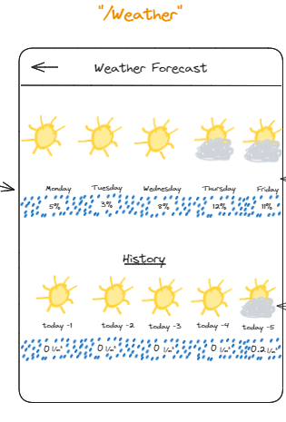

---

 
 

### **as a Player, i want to be able to plant my seeds on my farm to grow them**.

 

- [ ] display the farm tiles
- [ ] player can only plant seeds on empty plots
- [ ] give error message when player has no seeds

 
 

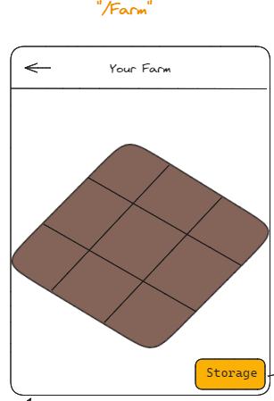
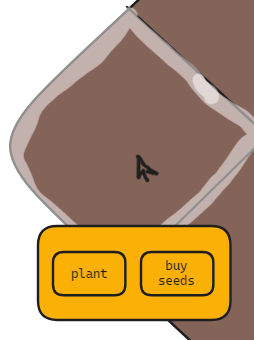

---

 
 

### **as a Player i want to be able to see the status of my plants, in order to know when they are ready for harvesting.**

 

- [ ] when hovering over a plant an info window should appear
- [ ] the window should display the water lever, current growth rate and growth time
- [ ] growth rate should have a different color depending on the percentage

 
 

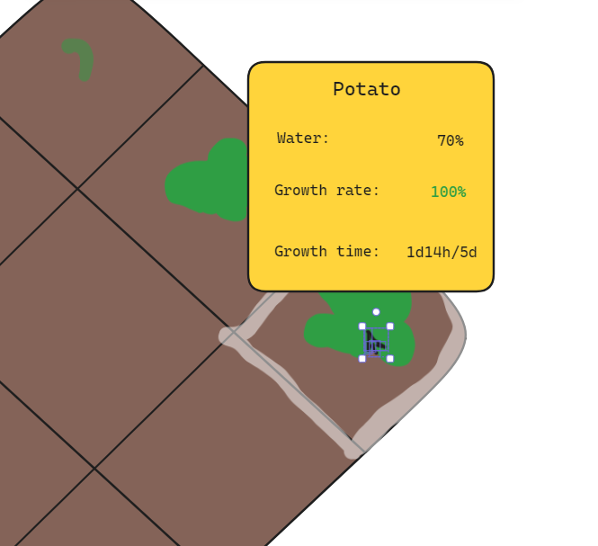

---

 
 

### **as a Player i want to be able to remove my plants in case i want to use the land for something else.**

 

- [ ] when clicked the window stays and now displays a kill plant button
- [ ] when clicked the user gets prompted again to make sure he doesnt kill the plant by accident

 
 

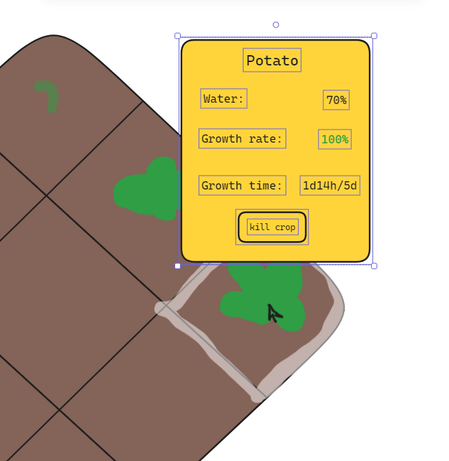

---

 
 

### **as a Player i want to be able to buy more land, to be able to grow even more plants.**

 

- [ ] display a button to buy more land and the requirements (red if player has not enough and green if he has enough)
- [ ] add empty land/plots to the farm and remove payed gold and goods from inventory

 
 

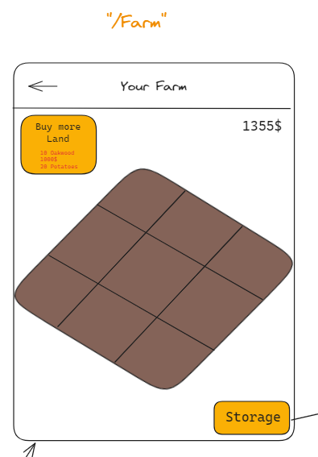
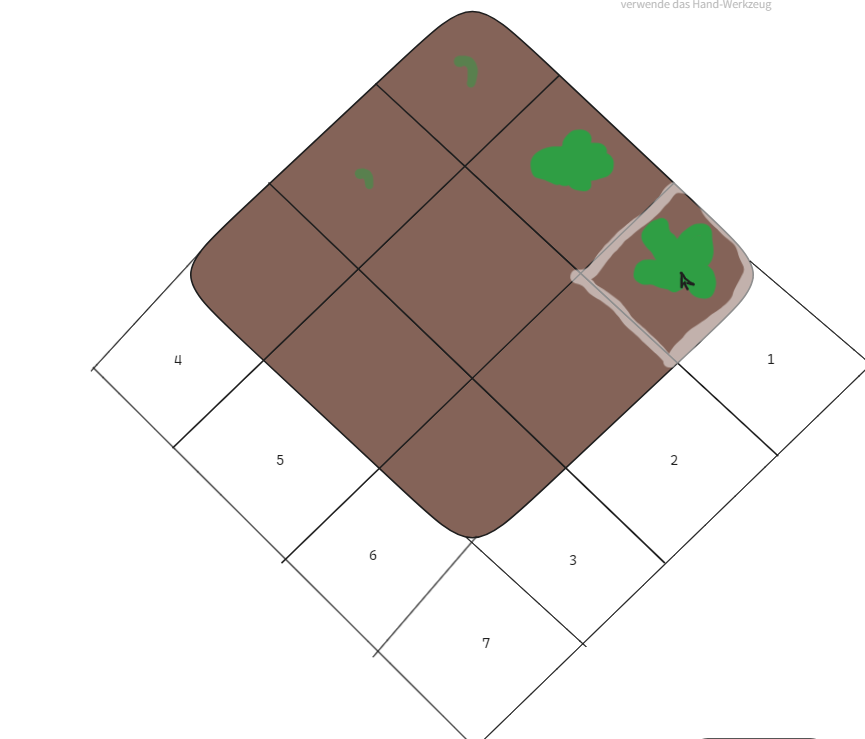

---

 
 

### **as a Player i want to be able to see my Rank compared to other Players, to have a motivation to make more money.**

 

- [ ] display rank, player name, total earned money and number of plants collected
- [ ] display the top 20 players
- [ ] extra: highlight the logged in player

 
 

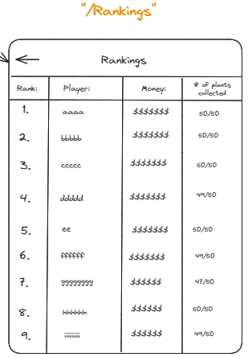

---

 
 

### **as a Player i want to be able to sell my crops on the market, so that i can earn money to climb up in the rankings.**

 

- [ ] display: name, image, price, available amount of plant and buy button
- [ ] display current money
- [ ] have a searchbar to filter the list
- [ ] make a "sell" button to sell plants

 
 

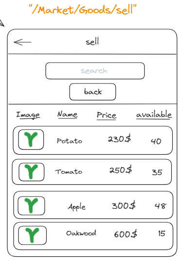

---

 
 

### **as a Player i want to be able to have an overview of all Products on the market, to navigate to the one i want to buy or see details of.**

 

- [ ] display: name, image, price, available amount of plant and buy button
- [ ] display current money
- [ ] have a searchbar to filter the list
- [ ] make a "sell" button to sell plants

 
 

.PNG>)

---

 
 

### **as a Player i want to see statistics of certain Crops, on order to make an informed decision on which seeds to buy next.**

 

- [ ] display: rank, 24h/7day/30day trends, market volume, all time high, 24h peak/low
- [ ] display a graph as shown

 
 

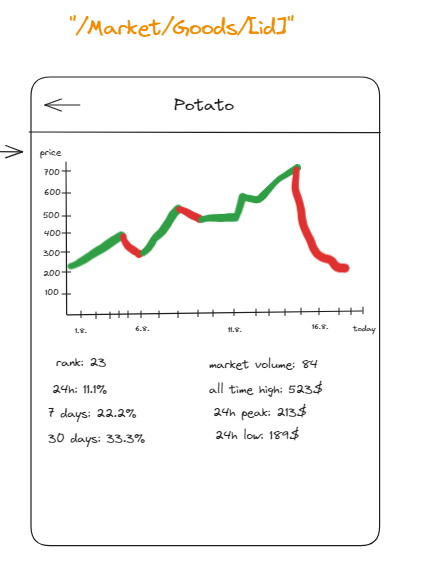

---

 
 

### **as a Player, i want to buy seeds to be able to grow more plants.**

 

- [ ] display name, image, price, buy button
- [ ] create a searchbar to filter the displayed list

 
 

.PNG>)

---

 
 

### **as a Player, i want to be able to see all plants in my Storage, to be able to sell them before they expire.**

 

- [ ] display name, image, expires in, amount, and buy buton with price
- [ ] searchbar
- [ ] extra: click on item brings player to details page

 
 

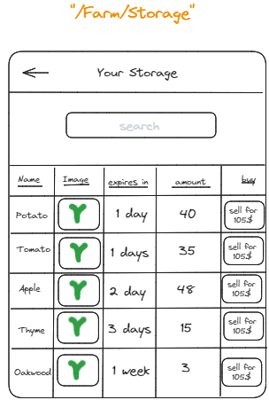

---

 
 

### **as a player, i want to be able to see my data about my profile, to see my progress.**

 

- [ ] display total money earned, unique plants collected, registered location and
      date of account creation

 
 

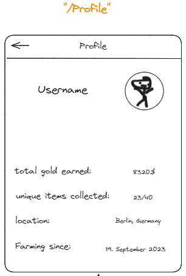

---

 
 

### **as a player, i want to be able to change my profile picture, in case i dont like my current one anymore.**

 

- [ ] display username and profile picture
- [ ] user can click on profile picture to upload new image

 
 

---

 
 
